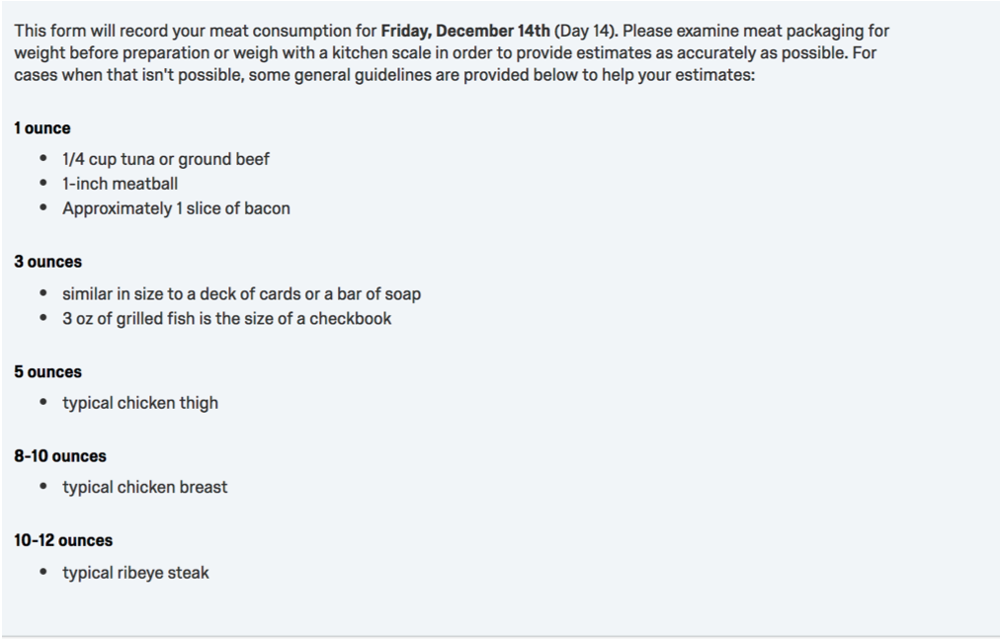
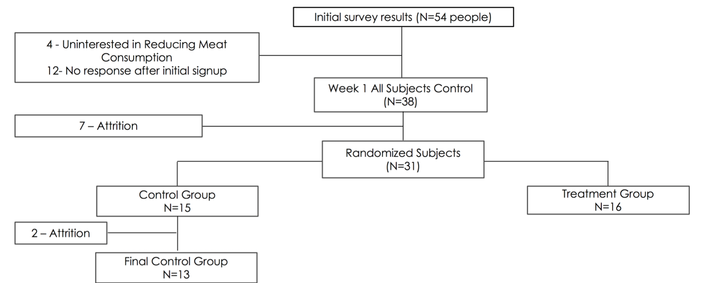
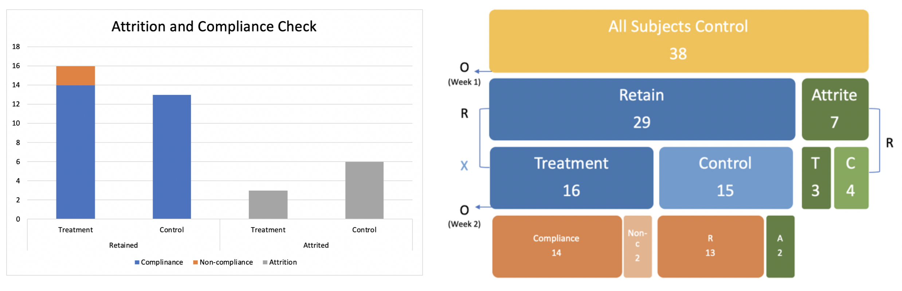
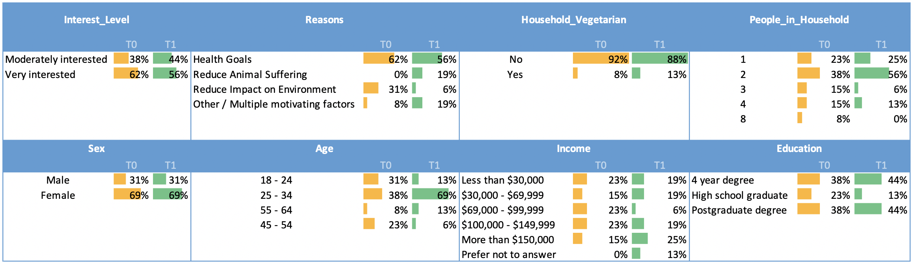
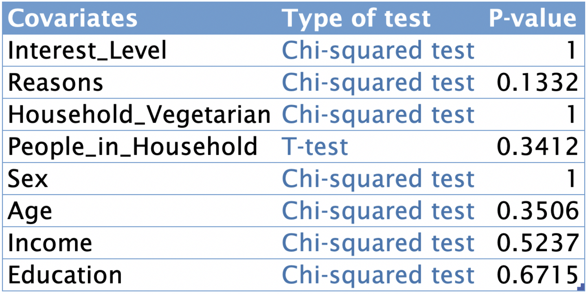

```{r}
# load packages 
library(foreign)
library(dummies)
library(data.table)
library(MASS)
library(ggplot2)
library(lmtest)
library(stargazer)
library(multiwayvcov)
library(FedData)
library(sandwich)
library(sp)
library(pwr)
library(plotrix)
```

# Background

There are a number of reasons for organizations and governments to promote the reduction of meat consumption, including the goals of reduced animal suffering, reduced rate of climate change and fresh water contamination, food sustainability, and the potential improvements in population health. As a result, different campaigns aimed at this goal have been employed by various environmental, animal rights, and health focused groups. One such campaign, sometimes called "Meatless Monday"", focuses on participants eliminating eating animals for one day per week. Some of these campaigns have made claims of how much water, greenhouse gas emissions or number of animals that this participation is expected to save; however, these estimates assume both that a participant's meat consumption is consistent with average meat consumption and that a participant's meat consumption on days other than Monday (or whatever day chosen) does not change due to their participation in the campaign. 

# Research Question

It is not currently clear how reasonable these two assumptions are. It may be that the meat consumption of those open to participating in these programs is not consistent with the average level. These people are likely to have prior knowledge of some of the adverse effects of eating meat advertised by the campaign, so a person with an interest in participating in one of these programs may already be eating less meat than average. It also may be reasonably argued that actively choosing to reduce meat consumption on one day of the week could result in the participant modifying their behavior on the other days of the week. The participant could consciously or unconsciously compensate for their meatless day by eating more meat on other days of the week. Alternatively, participation on a weekly basis may keep the goal of reduced meat consumption more present in the participant's mind and help them to further reduce meat consumption on other days of the week. This experiment aims to quantify the true effect on overall meat consumption, as this would be useful to organizations interested in promoting reduction in order to compare the value of such a campaign against other areas of investment. 

# Experiment

## Design

The study follows a two-group, within-subjects design as depicted in Figure 1. The primary data collected was the weight of each participant's meat intake over the course of the study. All subjects were observed for one week to gather daily measurements of meat consumption through self-reported surveys. In order to help ensure the measured effect is an unbiased estimate of the effect of treatment, subjects were then randomly divided into treatment and control groups. The night before the beginning of the second week of observation, the participants randomized into the treatment group received an additional email asking them refrain from eating meat one day in the upcoming week. They were asked to identify the day of their choice using an additional single question survey. No additional contact was made with participants in the control group.  

```{r pressure1, echo=FALSE, fig.cap="Experimental Design", out.width = '50%', fig.align='center'}
#
```

## Daily Measurements 

Participants were asked to weigh meat or examine meat packaged for the given weight, if possible, and failing this provide a description along with a weight or volumetric estimate. Accepting estimates in addition to measured data was expected to improve compliance relative to a more strict procedure. In order to aid participants and promote consistency among estimates, the same guidelines on judging meat weight were provided at the beginning of each daily survey. These guidelines are provided in Figure 2.

```{r pressure2, echo=FALSE, fig.cap="Example of Survey Guidelines", out.width = '100%', fig.align='center'}
#
```

## Participants

Potential study participants were obtained through an online Qualtrics survey. Links were sent out identifying that a study was recruiting participants interested in reducing the amount of meat they were currently eating. Only respondants that selected that they had an interest in this were accepted in the study. The effect of treatment is only desired for the subset of the population interested in reducing their meat consumption, since Meatless Monday campaigns are voluntary. The effect among the general population, if it could be obtained, would be of less value. This survey was also used to obtain demographic information on each participant that was thought could be potentially useful in identifying heterogeneous treatment effects.  

As shown in Figure 3 outlining the experimental procedure, 54 responses were obtained from the initial survey. Fifty of these people identified that they were interested in reducing the amount of meat they were eating and signed up for the experiment. Of these, 12 did not respond to any further follow-up data collection emails.

```{r pressure3, echo=FALSE, fig.cap="Experiment Progression", out.width = '100%', fig.align='center'}
#
```


```{r echo=FALSE,warning=FALSE}
# Loading the data
d <- fread("daily_totals_supply.csv")

# Check if there are any records with more than 2 missing datapoint
print(d[(rowSums(is.na(d))) > 2,])


# Remove any rows that is missing more than 2 datapoints
d.v1 <- d[(rowSums(is.na(d))) <= 2,]


# Convert columns day4 and day12 to double. This will help with imputing data
d.v1$Day4 = as.double(d.v1$Day4)
d.v1$Day12 = as.double(d.v1$Day12)

# Impute the missing data with the week's average
d.v1[(rowSums(is.na(d.v1))) > 0,Day4:=(Day1+Day2+Day3+Day5+Day6+Day7)/6]
d.v1[(rowSums(is.na(d.v1))) > 0,Day12:=(Day8+Day9+Day10+Day11+Day13+Day14)/6]


# Transpose the dataset to convert meat consumption during various days from column to rows.
d.transformed <- melt(d.v1[,1:25], id.vars = c("ID","Treatment","Sex","Age","Income","Household_Vegetarian","People_in_Household","Interest_Level","TreatmentDay","Reasons","Education"))

# Convert the variable column to a character 
d.transformed<-d.transformed[,variable:=as.character(variable)]

# Create a new column to represent the number of the day
d.transformed<-d.transformed[,day.no:=sapply(strsplit(d.transformed$variable, split='Day', fixed=TRUE),function(x) (x[2]))]

# Covert day number to an ordered categorical variable.
d.transformed$day.no <- ordered(d.transformed$day.no, levels = 1:14,
                              labels = c("1", "2", "3", "4","5","6","7","8","9","10","11","12","13","14")) 

# Create a treatment variable. If the treatment variable is zero, then the subject is in control or else the subject is in treatment. D is 1 for all subjects in treatment during week2.
d.transformed[, D := ifelse(Treatment == 0 , 0, ifelse(day.no<=7,0,1))]

# Create an indicator variable for the day of the treatment
d.transformed[, treated.day := ifelse(Treatment == 0 , 0, ifelse(day.no == TreatmentDay,1,0))]

# Create a week variable to indicate the treatment week and the control week.
d.transformed[, week := ifelse(day.no <=7, 0, 1)]

# Create a new variable called treatment status to capture the four periods : control, anticipation, treatment day and post treatment. Anticipation period begins on day 8 till the day before the treatment day.

d.transformed[, treatment.stages := ifelse(D == 0 ,"Control",ifelse(day.no<TreatmentDay,"Anticipation",ifelse(day.no==TreatmentDay,"Treatment Day","Post Treatment")))]

``` 
## Compliance and Attrition
Table below shows the attrition and non-compliance. There are 29.5% attrition before the first week, and 18.4% attrition after the first week. In order to avoid the effect of attrition on randomization, retain subjects and attrite subjects are randomly assigned treatment or control separately. After the second week, 6.9% attrition happened. Notice that, we imputed one attrited subject’s data with 2 NAs data points under control group.

As for the complaisance check, there are 12.5% non-compliance in treatment group. This experiment is intended to figure effect of meatless campaign on the weekly meet consumption. The experiment does not focus on whether people who did meatless one day can reduce the overall weekly meat consumption. It is care about whether noticing people about the meatless campaign can reduce the weekly meat consumption.  In this case, Average Treatment Effect (ATE) or Intended to Treat (ITT) is the key outcome, instead of Complier Average Causal Effect (CACE). The analysis can still include the data of two non-compliers as treatment outcomes. 



# Results

## EDA

### Overall Distribution of daily meat consumption by treatment and control groups

```{r}
stat_box_data <- function(y, upper_limit = max (y)*1) {
  return( 
    data.frame(
      y = 0.97 * upper_limit,
      label = paste('count =', length(y), '\n',
                    'mean =', round(mean(y), 2), '&',
                    'sd =', round(sd(y), 2), '\n')
    )
  )
}

ggplot(data=d.transformed, aes(x=as.factor(Treatment), y=value)) +
    geom_boxplot(aes(colour = as.factor(Treatment)),outlier.colour = "red", outlier.shape = 1) +ylab("Meat consumption in Ounces")+xlab("Treatment / control")+ ggtitle("Distribution of daily meat consumption by treatment and control groups") +geom_jitter(aes(as.factor(Treatment),value,shape=as.factor(week)),
               position=position_jitter(width=0.2,height=0),
               alpha=0.6,
               size=1)  +   stat_summary(
    fun.data = stat_box_data, 
    geom = "text", 
    hjust = 0.5,
    vjust = 0.9,
    position = position_dodge(width = 0.7)
  ) + labs( shape="Week", colour="Treatment")

```

By looking at the above boxplot, we can see that subjects in control have a lot more variability than those in the treatment group from a daily meat consumption perspective. 

Overall, across both the weeks, the average daily meat consumption for the treatment group is less than that for the control group by about 2.4 ounces.

Let's break down this variability by the individiual weeks.

### Distribution of daily meat consumption by treatment and control groups for Week 0 and Week 1 individually

```{r echo=FALSE}

ggplot(data=d.transformed, aes(x=as.factor(Treatment), y=value)) +
    geom_boxplot(aes(colour = as.factor(Treatment)),outlier.colour = "red", outlier.shape = 1) +ylab("Meat consumption in Ounces")+xlab("Treatment / control")+ ggtitle("Distribution of daily meat consumption by treatment and control groups") +geom_jitter(aes(as.factor(Treatment),value,shape=as.factor(week)),
               position=position_jitter(width=0.2,height=0),
               alpha=0.6,
               size=1)  +   stat_summary(
    fun.data = stat_box_data, 
    geom = "text", 
    hjust = 0.5,
    vjust = 0.9,
    position = position_dodge(width = 0.7)
  ) + labs( shape="Week", colour="Treatment")+facet_grid(as.factor(week) ~ .) 

```

The above plot shows the distribution of meat consumption for 2 weeks for both the treatment and the control group.
Both the treatment and control group are in "control" for week 0 and the treatment group goes in to treatment in week 1. 
For both week 0 and week1, the average daily meat consumption per person for the control group is greater than that of treatment group.

Going in to week1, the mean for the control group has increased by about 0.4 ounce and the mean for treatment group has decreased by about 0.4 ounce. 

This seems to suggest that from a baseline meat consumption perspective, people in the treatment group already consume less meat than those in the control group. We will need to check if this difference is breaking the exclusion restriction assumption. That is, are the other factors that are causing the subjects in the treatment group to consume less meat?


Let's check the distribution of meat consumption for individuals in the treatment group


```{r}

d.transformed$treatment.stages <- factor(d.transformed$treatment.stages,levels = c('Control','Anticipation','Treatment Day','Post Treatment'),ordered = TRUE)

ggplot(data=d.transformed[d.transformed$Treatment==1], aes(x=treatment.stages, y=value)) +
    geom_boxplot(aes(colour = as.factor(treatment.stages)),outlier.colour = "red", outlier.shape = 1) +ylab("Meat consumption in Ounces")+xlab("Treatment / control")+ ggtitle("Distribution of daily meat consumption for the treatment group by treatment stages") +geom_jitter(aes(as.factor(treatment.stages),value,shape=as.factor(week)),
               position=position_jitter(width=0.2,height=0),
               alpha=0.6,
               size=1)  +   stat_summary(
    fun.data = stat_box_data, 
    geom = "text", 
    hjust = 0.5,
    vjust = 0.9,
    position = position_dodge(width = 0.7)
  ) + labs( shape="Week", colour="treatment.status")

```

A. When we observe the average meat consumption across the various treatment stages, the average meat consumption per day for the treatment group (but in control) during week 0 is 5.56 ounces. 

B. Interestingly, once we let the treatment group know that they need to pick a day in week 1 to go meatless, there seems to be some anticipatory effect, atleast as suggested by our mean estimator. In this case, during the time the subjects are waiting in anticipation of the treatment day, their average daily meat consumption goes up by near 1 ounce. 

C. Ofcourse, on the day of the treatment, we expect to see a drastic reduction in meat consumption owing to the very nature of the treatment. In this case, their average daily meat consumption reduces to 2.25 ounces.

D. Finally, after the treatment day, their average daily meat consumption gies up to 5 but still is lower than the baseline average from week0.


### Individual Distribution of daily meat consumption for treatment and control group
```{r}


ggplot(data=d.transformed, aes(x=ID, y=value)) +
    geom_boxplot(aes(colour = as.factor(ID)),outlier.colour = "red", outlier.shape = 1) +ylab("Meat consumption in Ounces")+xlab("Treatment / control")+ ggtitle("Distribution of daily meat consumption for the treatment group by treatment stages") +geom_jitter(aes(as.factor(ID),value,shape=as.factor(week)),
               position=position_jitter(width=0.2,height=0),
               alpha=0.6,
               size=1)  + labs( shape="Week", colour="ID")+theme(axis.text.x = element_text(angle = 90, hjust = 1),legend.position="bottom")+facet_grid(as.factor(Treatment) ~ .) + coord_flip()

```

We can see that for both the control group, there are 3 subjects that are actually driving up the average daily meat consumption. The subjects have high variability as far as their daily meat consumption goes.

And for the treatment group, there is one subject that are actually driving up the average daily meat consumption.

It will be really interesting to cluster by the individual IDs when estimating the treatment effect and standard error.


### Added variable plot

```{r echo=FALSE}

# Linear regression of daily meat consumption on ID
lm1 <- lm(value~ID,data=d.transformed)
# Linear regression of the treatment indicator on ID
lm2 <- lm(D~ID,data=d.transformed)

#Get the residuals from lm1. This captures the variance in the outcome not captured by ID
d.transformed[,residuals_y := list(lm1$residuals)]

#Get the residuals from lm2. This captures the variance in the treatment assignment not captured by ID
d.transformed[,residuals_d := list(lm2$residuals)]

# Scatterplot between daily meat consumption and treatment after controlling for the covariate ID
ggplot(d.transformed, aes(x=residuals_d, y=residuals_y)) +
  geom_point() + 
  geom_smooth(method=lm)

```


The above plot controls for the variance in the outcome (meat consumption) as well as in the treatment assignment due to the covariate (in this case, ID).  This seems to suggest that there is a slight reduction in meat consumption when the subject go from untreated to treated.


# Covariate Balance Check
The first survey asking subjects about eight covariates. ‘Interest_Level’ covariate is to check the subjects interest level of reducing meat consumption. Because before entering the covariates, the survey filtered out 4 subjects who are not interested in reducing meat consumption, subjects who can continue the survey is either moderately interested or very interested. ‘Reasons’ covariate is to check the reasons why people choose to reduce meat consumption. It is possible that people with different motivations have different reaction to treatment campaign. ‘Household_Vegetarian’ variable is to check if there is any vegetarian in household. People who have vegetarian family member may have different reaction to the treatment. ‘People_in_Household’ covariate is to present the number of people in household. People come from different size of family may have different meat consumption behaviors. ‘Sex’, ‘Age’, ‘Income’, and ‘Education’ are the demographic covariates. 

Table below shows the distribution of the covariates in treatment and control group. According to the histograms, the covariates looks balanced, except for some of them, such as ‘Reduce Animal Suffering’ from ‘Reasons‘.  


Table below shows the t-test and chi-squared test for checking whether the covariates in treatment and control groups are different with each other. The null hypothesis is the default assumption that no difference in proportions of the covariates from treatment and control group. The p-value of all the covariates are above 0.05, indicating that we cannot reject the null hypothesis. Notice that the least ‘Reasons’ has the least p-value 0.1332, which is mainly due to the unbalanced ‘Reduce Animal Suffering’ mention previously. 

```{r echo=FALSE}
#d[ , t.test(Interest_Level ~ Treatment)]
#t.test(d$Interest_Level[d$Treatment==0],d$Interest_Level[d$Treatment==1])
d[ , chisq.test(Interest_Level, Treatment)]
d[ , chisq.test(Reasons, Treatment)]
d[ , chisq.test(Household_Vegetarian, Treatment)]
d[ , t.test(People_in_Household ~ Treatment)]
d[ , chisq.test(Sex, Treatment)]
d[ , chisq.test(Age, Treatment)]
d[ , chisq.test(Income, Treatment)]
d[ , chisq.test(Education, Treatment)]

```
```{r}
d[ , .(Interest_Level = chisq.test(Interest_Level, Treatment)$p.value, 
       Reasons = chisq.test(Reasons, Treatment)$p.value, 
       Household_Vegetarian = chisq.test(Household_Vegetarian, Treatment)$p.value,
       People_in_Household = t.test(People_in_Household~ Treatment)$p.value,
       Sex = chisq.test(Sex, Treatment)$p.value,
       Age = chisq.test(Age, Treatment)$p.value,
       Income = chisq.test(Income, Treatment)$p.value,
       Education = chisq.test(Education, Treatment)$p.value)
  ]


```
{width=250px}


In addition, we implemented the ANOVA test between the model of covariates predicting treatment and the null model. The p-value is larger than 0.05, indicating that there is no information indicating failed randomization.
```{r}
mod <- glm(Treatment ~ 1+Interest_Level+ Household_Vegetarian+People_in_Household+Sex+Age+Income+Education,
           data = d,
           family = "binomial")
summary(mod)
mod.null <- glm(Treatment ~ 1, data = d, family = "binomial")
summary(mod.null)

anova(mod, mod.null, test = "LRT")
```

# Placebo Test

```{r}
d$Pre = (d$Day1+ d$Day2+ d$Day3+ d$Day4+ d$Day5+ d$Day6+ d$Day7)/7
summary(lm(Pre~Treatment,d))
```
The randomization did a good job on assign each individual to have treatment week or control week, since "Treatment" cannot have significant coefficient to predict weekly meat consumption.

```{r}
summary(lm(Meat_Comsumption~Treatment,d_pivot[d_pivot$Week2==0]))
```
The coefficient of "Treatment" predicting daily "Meat_Comsumption" is a little statistical significance, with p-value 0.0439. because to determind whether one day is in treatment or control is clustered by ID. 

```{r}
summary(lm(Meat_Comsumption~Is_TreatmentDay,d_pivot[d_pivot$Week2==1]))
```
"Is_TreatmentDay" is not randomly assigned by design, since people choose which day of week to have meatless. 

# Treatment Effect
## Models discussion
```{r}
d_pivot <- fread('daily_totals_pivot.csv')
head(d_pivot)
```


```{r}
#First model
summary(lm(Meat_Comsumption~Week2+Treatment+Week2*Treatment+ID,d_pivot))
```


```{r}
0.04899-0.81227
```
Not significant

```{r}
#Adding Is treatment day - significant, but SE not better
summary(lm(Meat_Comsumption~Week2+Treatment+Week2*Treatment+ID+Is_TreatmentDay,d_pivot))
```

```{r}
#Add pre post comsuption - No significanr, SE not better
summary(lm(Meat_Comsumption~Week2+Treatment+Week2*Treatment+ID+Is_TreatmentDay+Pre_Day_Consumption+Post_Day_Consumption,d_pivot))
```

```{r}
#good covariates - Some significance, better SE
summary(lm(Meat_Comsumption~Week2+Treatment+Week2*Treatment+Is_TreatmentDay+Interest_Level + Reasons + Household_Vegetarian + People_in_Household + Sex + Age + Income + Education,d_pivot))
```
**least SE of Treatment and Week2:Treatment**


```{r}
#Add if before or after treatment day - No significanr, SE not better
summary(lm(Meat_Comsumption~Week2+Treatment+Week2*Treatment+ID+Is_TreatmentDay+One_Day_Before_TD+Two_Day_Before_TD+Three_Day_Before_TD+One_Day_After_TD+Two_Day_After_TD+Three_Day_After_TD,d_pivot))
```
**days before people eat more, and days after people eat less.**
**ID6C NA, no comparison data?**
**0.07-0.44m negative effect but not stats significant**

```{r}
#all covariates, in mass
#summary(lm(Meat_Comsumption~Week2+Treatment+Week2*Treatment+ID+Is_TreatmentDay+One_Day_Before_TD+Two_Day_Before_TD+Three_Day_Before_TD+One_Day_After_TD+Two_Day_After_TD+Three_Day_After_TD+Interest_Level + Reasons + Household_Vegetarian + People_in_Household + Sex + Age + Income + Education,d_pivot))
```


```{r}
#Outcome Weekly_Meat_Com - significant
summary(lm(Weekly_Meat_Com~Week2+Treatment+Week2*Treatment+ID+Is_TreatmentDay,d_pivot))
```
**Significant with "Treatment", but not "Week2:Treatment"**

```{r}
#Outcome Pre_Day_Consumption - Not randomly assigned, but positive cor
summary(lm(Pre_Day_Consumption~Week2+Treatment+Week2*Treatment+ID+Is_TreatmentDay,d_pivot))
```
**Not randomly assigned treatment day, no casual inference. Positive correlation with "Is_TreatmentDay", not significance.**


```{r}
#Outcome Post_Day_Consumption - Not randomly assigned, but positive cor
d_pivot_post = d_pivot[!(d_pivot$Treatment_Day==14),]
summary(lm(Post_Day_Consumption~Week2+Treatment+Week2*Treatment+ID+Is_TreatmentDay,d_pivot_post))
```

**Not randomly assigned treatment day, no casual inference. Positive correlation with "Is_TreatmentDay", not significance.**

# Statistical Power (need to redu the d, by std of treatment and interactive term treatment*week2)
By having statistical significance in the estimated treatment effect, the experiment data has high statistical power. Figure below shows that had we rejected the null hypothesis, we would have a 99.98% powered test. This result is mainly due to the large treatment effect (d). 
```{r}
pwr.t2n.test(n1 = 16, n2 = 13, d = -0.28)
```
The result above shows that the power calculation based on 16 subjects assigned to treatment group and 13 subjects assigned to control group, and a Cohen’s d effect size determined from the experimental results of the number of questions correctly answered by each subject. Cohen’s d is the difference in means between the treatment and control group outcomes, divided by the pooled standard deviation. 

In order to have a 90% power test, only around 14 subjects would be needed. The results below shows the number of subjects required per treatment and control group for an 90% powered test and Cohen’s d effect size matching the experimental results.

```{r}
pwr.t.test(d = 0.28, power = 0.9, 
          , alternative = "two.sided")
```

**???????????? doesn't make sensem, since we cannot get that big treatment effect.**
With our hypothesis that a week, that is treated by meatless on eday of week, would be different from the control week by reducing the average weekly consumption by 1/7th. Hence, this power calculation is looking at if we expect to be able to detect a treatment effect of that level, in order to get at least a decent 80% power, how many number of subjects does the experiment need. As a result, the experiment need 21 subjects t detect the desired treatment effect. 
```{r}
d$Pre = (d$Day1+ d$Day2+ d$Day3+ d$Day4+ d$Day5+ d$Day6+ d$Day7)/7
d$Post = (d$Day8+ d$Day9+ d$Day10+ d$Day11+ d$Day12+ d$Day13+ d$Day14)/7
d_e = mean(d$Pre)/7
d_e_se = sd(d$Pre/7)
d_p = d_e/d_e_se
pwr.t.test(d = d_p, power = 0.8, 
          , alternative = "two.sided")
```
The graph above shows that, if we already have the desired treatment effect, in order to get at least a decent 80% power, the experiment need to have at least 21 subjects. 


# Conclusions

